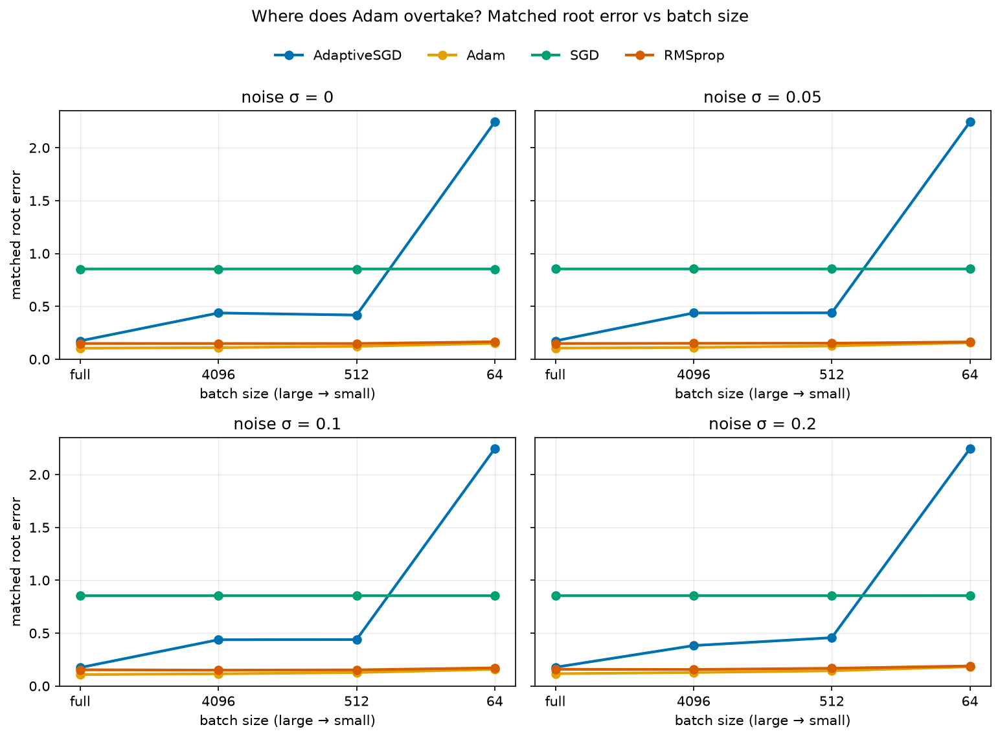
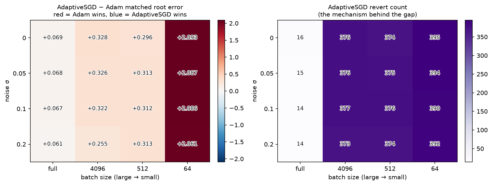

# Adaptive Backtracking vs. Adam

> A controlled study: **when does adaptive learning-rate backtracking hold up, and
> when do per-parameter moment estimates (Adam) win** — as a function of batch size
> and label noise?

## TL;DR
A custom optimizer, **AdaptiveSGD**, grows its learning rate when the loss falls
and reverts the weights when it rises. That rule needs a *trustworthy* loss signal.
Sweeping batch size × label noise × optimizer on a polynomial-root regression
testbed, under a fixed compute budget, the finding is:

**Batch size is the binding constraint; label noise barely matters.** AdaptiveSGD
is competitive at full-batch and collapses the instant you mini-batch — a cliff,
not a slope — and the revert count plus the learning rate explain exactly why.
(Adam is the strongest optimizer in every regime; the result is about *where and
why* AdaptiveSGD falls, not a leaderboard upset.)



## The finding

| Regime | Winner | Why (grounded in the diagnostics) |
|--------|--------|-----------------------------------|
| **Full-batch** (any noise) | Adam (0.105), but **AdaptiveSGD is competitive** (0.174) | Trustworthy signal → AdaptiveSGD reverts only ~15 / 400 decisions and its LR grows to the **ceiling** (1.0). |
| **Any mini-batch** (4096 → 64) | Adam, decisively | Subsampled loss is noisy → AdaptiveSGD reverts **~95%** of decisions, its LR collapses to the **floor** (1e-6), and error climbs 0.42 → **2.24** (worse than untrained). |

The heatmap makes the mechanism visible: the AdaptiveSGD−Adam gap (left) tracks the
revert count (right) cell-for-cell — near-tie and few reverts at full-batch, a red
cliff and saturated reverts everywhere else. The rows (noise) are near-identical,
which is the visual proof that **batch size, not noise, is the lever**.



**Why (one paragraph).** AdaptiveSGD decides accept-or-revert on the loss of a
fresh mini-batch, so that signal's noise grows as the batch shrinks. At full-batch
the signal is steady, the grow rule fires, and the LR rises to its cap. Under any
subsample a single unlucky evaluation trips the revert rule on nearly every check;
the shrink rule then starves the learning rate down to 1e-6 while most steps are
rolled back, so the network barely leaves initialization. That is the whole gap.
Full write-up with the numbers: **[ANALYSIS.md](ANALYSIS.md)**.

## What makes the comparison fair
- **Fixed budget** — every optimizer gets the same 4000 gradient *updates* (not
  epochs), so batch size can't buy extra steps.
- **Fixed decision cadence** — 400 accept/revert checks per run regardless of batch
  size, so the backtracking granularity doesn't vary with batch (SPEC §6).
- **Clean held-out validation** — the same val-best selection picks the final
  weights for *every* optimizer; the test set is never touched.
- **Permutation-aware metric** — roots are an unordered set, matched by Hungarian
  assignment before scoring, so ordering never confounds the result.

## What's here
- **AdaptiveSGD** — adaptive-LR backtracking as a training strategy (LR clamp,
  mini-batches, patience, revert counter): [`src/optimizers.py`](src/optimizers.py).
- **Matched baselines** — Adam / SGD / RMSprop through the same loop and budget:
  [`src/baselines.py`](src/baselines.py).
- **The metric** — Hungarian-matched root error: [`src/evaluate.py`](src/evaluate.py).
- **The study** — batch × noise × optimizer sweep:
  [`experiments/regime_study.py`](experiments/regime_study.py) → `results/`.
- **The analysis** — the mechanistic "why": [`ANALYSIS.md`](ANALYSIS.md).

## Quickstart
```bash
python -m venv .venv
source .venv/bin/activate            # Windows: .venv\Scripts\activate
pip install -r requirements.txt      # TensorFlow >= 2.21 (CPU is fine; no GPU needed)

pytest -q                                    # tests (run without TensorFlow)
python -m src.train --smoke-test             # single-run pipeline check
python experiments/regime_study.py --smoke   # fast sweep (seconds)
python experiments/regime_study.py           # full sweep -> results/ (CSV + both figures)
python experiments/regime_study.py --plots-only   # rebuild figures from the CSV
```
The full sweep is CPU-bound (~1.5–2 h on a laptop); `--smoke` validates the whole
pipeline in seconds. See [`SPEC.md`](SPEC.md) for the full design and threats to
validity; the original Colab prototype is preserved in
[`reference/`](reference/AdaptiveSGD_original.ipynb).

## Honest framing
AdaptiveSGD's grow/shrink rule is in the family of Levenberg–Marquardt damping and
RPROP-style adaptive rates. This project implements and *benchmarks* that idea; it
does not claim a new algorithm, and it does not tune each optimizer to death (one
fixed LR each — part of why SGD looks weak, and why AdaptiveSGD's trigger-happy
`patience=1` matters). The value is the controlled comparison and the mechanistic
explanation, not a leaderboard win. Results are reported as they fell — Adam wins
everywhere; the science is in the *why*.
